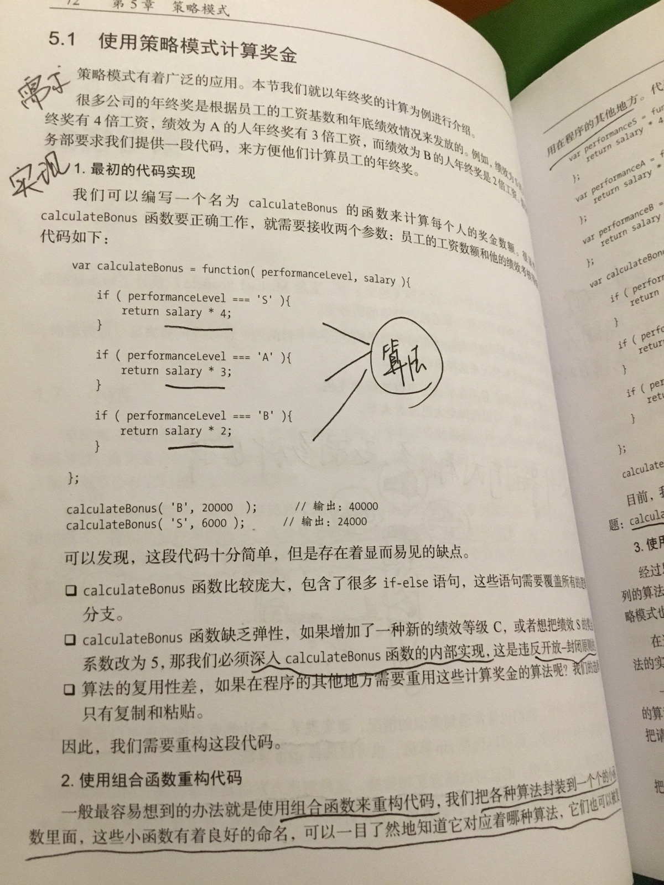

# 策略模式的学习心得

## 需求
很多公司的年终奖是根据员工的工资基数和年底效绩情况来发放的。例如：效绩为S的人年终奖有4倍工资，效绩为A的人年终奖有3倍工资，而效绩为B的人年终奖是2倍工资。假设财务部要求我们提供一段代码，来方便他们计算员工的年终奖，请实现.

## 过程

1.先不考虑设计模式，从一般情况入手，当我们拿到一个需求的时候，我们一开始会如何实现，此时会暴露/存在哪些问题

2.引入设计模式。先看看它描述了什么

3.使用设计模式重构

## 分析

</img>

**函数比较庞大：** 
对这里的理解是别忘了这里是简易算法表示，用1行代码代替了1000行甚至10000行的算法实现。试想假如这里是1000行代码，当我们读这段代码的时候是什么感受===> 如果效绩等级为S，则…….获取金额，循环，加减乘除等等乱七八糟，然后头晕。这里感受不明显是因为只用了一行代码做实现，感觉不到复杂度和难理解性，还会有一种和函数调用类似的错觉，因为都是一行代码。

**函数缺乏弹性：** 
如果我们需求变更，要求修改或增加一种新的效绩等级，我们该怎么做？首先不会像现在这样一瞬间就找到第三个if，在之后加上一个新的if，而是首先定位到这个函数，开始理清这段代码干了什么，然后增加代码进行实现，这意味着修改源代码，违反了开放封闭原则，同时不好做单元测试，最后考虑变量的问题，如果引入新的中间变量做内部实现还得考虑不会发生变量冲突的问题……至少通读一遍以上代码是需要的。这也是为什么一个函数过于封装过多职责不好（难理解，修改困难，考虑方面多），也是为什么要把大函数拆成小函数的原因===>职责单一，便于理解，方便定位修改，解决变量冲突问题。

**算法难以复用：** 
算法实现都写在一个函数里，当别的地方需要复用某一算法时，难以复用；即便是目前暂时能完全复用这个大函数，但是当别的地方需要修改需求也就是如上的增加新的算法或者修改已有的条件，这段函数无法修改。因为他在其他地方被引用了，修改意味着其他地方可能不工作。

**重构1：**
使用组合函数的方式进行重构，我们把各个算法封装到一个小函数里面，这些小函数有着良好的命名，可以一目了然地知道它们对应着哪种算法，它们也可以重用在程序的其他地方===>解决了算法的复用，算法实现中间变量冲突的问题，caculateBonus的逻辑变清晰了些。
但是弹性问题依旧没有解决：函数可能变得越来越庞大，需求变更时不是以扩展增加代码的方式优雅增强，而是改动函数内部代码违反开放封闭原则。

**那么我们用策略模式是怎么做的呢？**
策略模式的目的就是将算法的使用和算法的实现分离
算法的使用是不变的，都是根据某个算法取得计算后的奖金数额。而计算的实现是各异和变化的。

传统的面向对象语言实现的策略模式包含一组策略类和一个环境类，环境类实际上就是应用场景，而它们之间的通信就是环境类持有一个策略类的引用（内部维护一个Strategy的实例），环境类并不实现策略，不直接解决需求，负责动态设置运行时Strategy具体的实现算法，把客户的需求委托给策略类实现(注意核心在于设置)，负责跟Strategy之间的交互和数据传递。这么做的好处在于：代码清晰，职责明确，当需求变更的时候，只需要通过替换引用的方式替换不同的算法。当新增算法的时候也是通过增加而非修改的方式进行。当修改算法内部实现的时候，也可以更快的定位到某个算法内部。

通过实现策略模式来重构代码，我们消除了原程序中大片的条件分支语句。所有跟计算奖金有关的逻辑不再放在Context中，而是分布在各个策略对象中。Context并没有计算奖金的能力，而是把这个请求委托给某个策略对象，策略对象负责这个职责。每个策略对象负责的算法封装在对象的内部，当我们对这些策略对象发出“计算奖金”请求时，它们会返回各自不同的计算结果，这正是对象多态的体现，也是它们可以相互替换的目的。替换Context中当前保存的策略对象，便能执行不同的算法来满足需求的变更。

## 从策略模式中学到了什么?
1. 分而治之有利于维护
2. 一个函数不应该包含太多的职责，有利于维护
3. 找到程序中可变部分和不可变的部分，进行分离
4. 策略模式要解决的问题就是：当做一件事的方式有很多种，并且这些方式都是可以相互替换时，我们应该使用策略模式管理相关算法族或者以避免多重条件转义语句，这也当需求变更时可以在运行时动态替换。策略的变化独立于使用它的客户而独立变化。
5. 多重条件转移语句不易维护，它把采取哪一种算法或者哪一种行为的逻辑混合在一起了，统统列在一个多重条件语句里，比使用继承的办法还要原始和落后。

## 遇到的问题和解决过程

### 1.对象之间如何优雅通信？策略模式的示例中是采用何种方式进行通信的？为什么？ 
描述：策略模式的实现把策略封装成了单独的一组策略类和环境类。而面向对象强调对象管理自身，分而治之，那么在每个类相对独立的情况下，环境类无法满足需求，该如何建立环境类和策略类之间的联系呢？也就是对象之间如何通信呢？

**探究关键词：** 对象如何通信 对象间的关系 

**结果关键词：** 采用建立引用的方式  泛化/继承、实现、依赖、关联

**拓展：**

1. 传统面向对象中的类设计分析

2. 绘制UML类图描述类的自身属性和方法以及类之间的关系，可视化的方式易于理解

**补充：**

条件转移语句就是一条是或者否的语句，处理器借以判定任何一个特定活动的当前状态。

